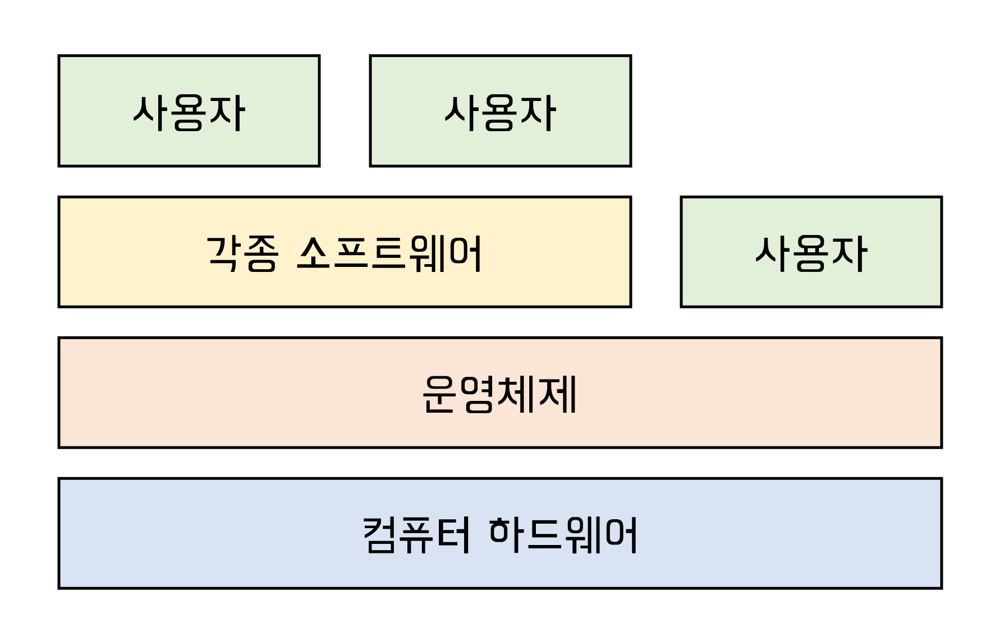
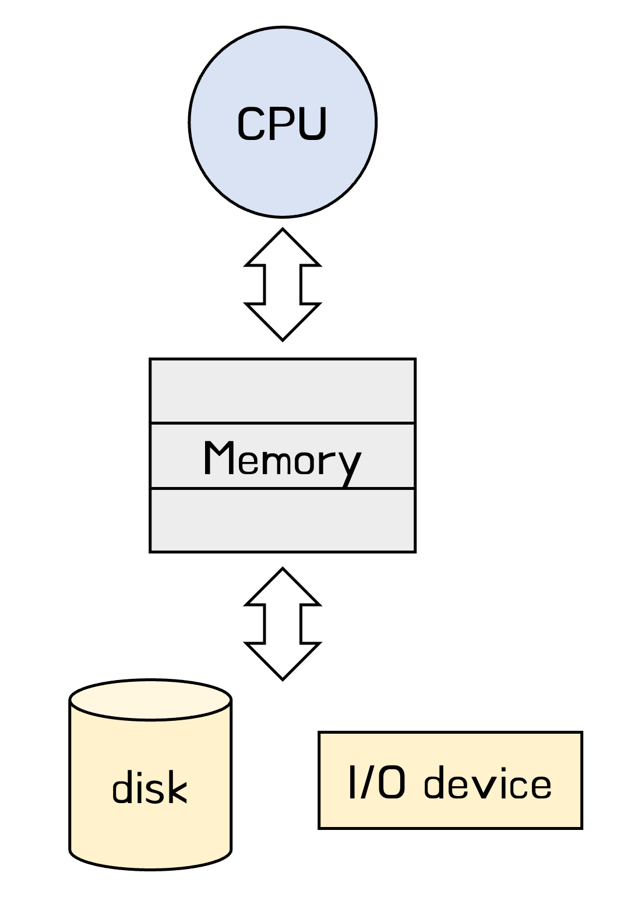

## 운영체제란

- 컴퓨터 하드웨어 바로 위에 설치되어 사용자 및 다른 모든 소프트웨어와 하드웨어를 연결하는 소프트웨어 계층
- 좁은 의미: 커널 (메모리에 상주하는 부분)
- 넓은 의미: 커널 + 유틸리티 (메모리에 상주 하지 않는 별도의 프로그램들)

## 운영체제 목적

- 컴퓨터 시스템을 편리하게 사용할 수 있는 환경을 제공
- **컴퓨터 시스템의 자원을 효율적으로 관리**
  - 형평성있는 자원분배, 주어진 자원으로 최대한의 성능을 내도록	
  - 하드웨어 자원: 프로세서, 기억장치, 입출력 장치 등
    소프트웨어 자원: 프로세스, 파일, 메세지

## 운영체제의 분류

### 동시 작업 가능 여부

- 단일 작업

  - 한번에 하나의 작업만 처리-> 단일 기능만을 이행하는 특수목적으로 제작된 기계에서 사용

  - MS-DOS

- 다중 작업

  - 동시에 두 개 이상의 작업 처리-> 범용컴퓨터

  - 현재의 운영체제 대부분 UNIX, MS Windows,..

### 사용자의 수

컴퓨터 한대를 여러 사용자가 동시에 접속해서 사용할 수 있는지에 따라 분류

- 단일 사용자
  - MS-DOS: 단일 사용자/ 단일 작업
  - MS Windows: 단일 사용자/ 다중 작업
- 다중 사용자
  - 다중 사용자의 경우에는 보안기능추가(파일 열람 등), 형평성있는 자원관리 
  - UNIX, NT server 

### 처리 방식

- 일괄 처리 (batch processing)
  - 작업 요청의 일청량 모아서 한꺼번에 처리- interactive X
  - 작업이 완전 종료될 때까지 기다려야 함
  - 초기 Punch Card 처리 시스템
- 시분할 (time sharing)
  - 컴퓨터의 자원을 일정한 시간 단위로 분할하여 사용
  - 일괄 처리 시스템에 비해 짧은 응답시간을 가진다 - (사람과) interactive한 방식
  - 자원을 여러 사람이 효율적으로 사용하기 때문에 데드라인을 지켜주는 것이 아님 (사람이 많을 수록 늦어질 수도)
  - UNIX
- 실시간 (Realtime OS)
  - 정해진 시간 안에 반드시 종료되어야 하는 데드라인이 있는  실시간 시스템(원자로, 반도체, 미사일, 로보트..등)을 위한 OS
  - 실시간 시스템의 개념 확장
    - Hard realtime system: 데드라인을 꼭 지쳐야 한다
    - Soft realtime system: 데드라인은 존재하지만 꼭 지켜지지 않아도 큰 문제가 생기지 않는다 (멀티미디어 스트림서비스)

## 운영체제의 구조

- 자원 관리 이슈
  - CPU 스케줄링
  - 메모리 관리
  - 파일관리/디스크 스케줄링
  - 입출력 관리 (I/O Device)
  - 프로세스 관리
    - 프로세스의 생성과 삭제
    - 자원 할당 및 반환
    - 프로세스 간 협력
  - 그외
    - 보호 시스템
    - 네트워킹
    - 명령어해석기(command line interpreter)

## 운영체제 용어

여러작업을 동시에 수행하는 것을 뜻하는 용어 (관점에 따라 달라짐)

- Multitasking: 동시에 수행되는 작업
- Multiprogramming: 메모리에 여러 프로그램이 동시에 올라가는 작업 **(메모리 측면 강조)**
- Time Sharing: 시간을 나누어 씀 **(CPU 강조)**
- Multiprocess
  - cf) Multiprocessor: CPU가 여러개/ 위에있는 용어들은 CPU 1개여도 가능

## 운영체제 예

- UNIX
- DOS
- MS Windows
- 모바일을 위한 OS

  
참고자료

  

    http://www.kocw.or.kr/home/search/kemView.do?kemId=1046323 
    Operating System Concepts 10th edition 
  

