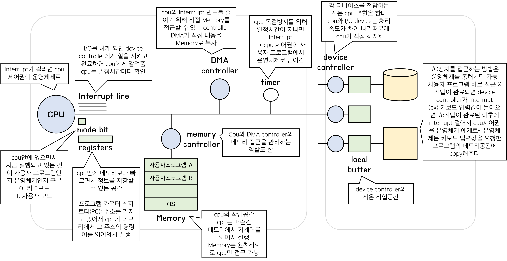
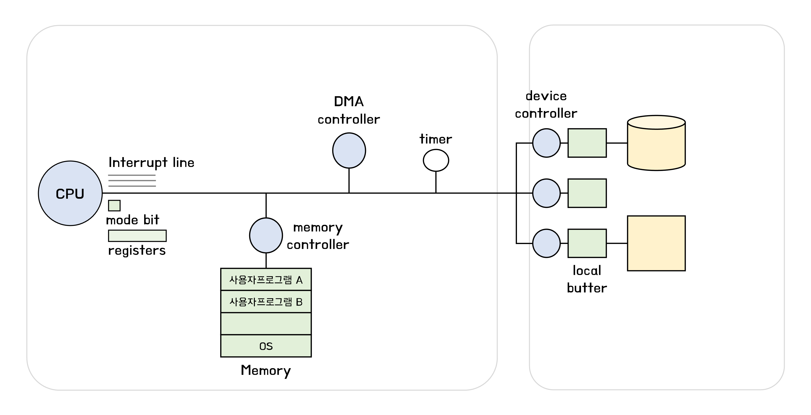
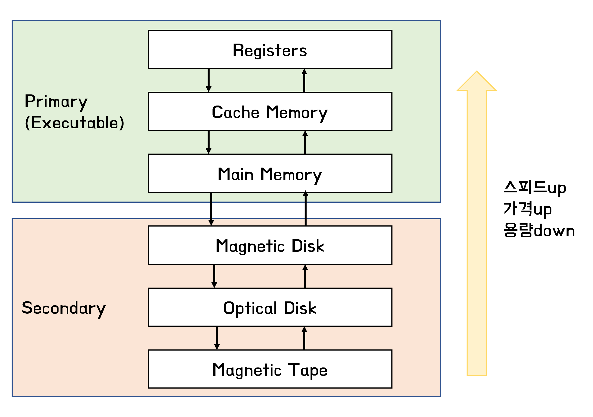

## 컴퓨터 시스템 구조

  
나중에 다시 해보기

  

    
  

### Mode bit

- 사용자 프로그램의 잘못된 수행으로 다른 프로그램 및 운영체제에 피해가 가지 않도록 하기 위한 보호 장치
  - 1: 사용자 모드: 사용자 프로그램 수행
  - 0: 커널 모드(모니터 모드, 시스템 모드): os 코드 수행
- 보안을 해칠 수 있는 명령은 커널 모드에서만 수행가능한 **특권명령**
- Interrupt나 Exception 발생시 하드웨어가 mode bit 0
- 사용자 프로그램에게 cpu 넘기기 전에 mode bit 1

### Timer

- cpu를 독점하는 것을 막기 위해
- 정해진 시간이 지난 후에 운영체제에게 제어권이 넘어가도록 Interrupt 발생
- 매 클럭마다 1씩 감소 -> 타이머 값이 0이 되면 타이머 Interrupt 발생
- Time Sharing 구현을 위해 널리 사용됨

### DMA (Direct Memory Access)

- 빠른 입출력 장치(이러면 CPU가 interrupt를 더 빈번하게 받는다)를 메모리에 가까운 속도로 처리하기 위해 사용

- CPU의 중재없이 device controller가 device의 buffer storage의 내용을 메모리에 block 단위로 직접 전송

  byte 단위가 아니라 block 단위로 인터럽트 발생시킴 -> 매번하는게 아니라 buffer에 block만큼 쌓이면 한번에 interrupt하면 DMA가 메모리에 접근

- CPU와 DMA 메모리 접근 중재는 메모리 컨트롤러의 역할

### Device Controller

- I/O device controller
  - I/O 장치를 전담하는 일종의 작은 cpu
  - 제어 정보를 위해 control register, status register를 가진다
  - local butter (일종의 data register)
- I/O는 실제 device와 local buffer 사이에서 일어남
- I/O가 끝나면 device controller가 interrupt로 cpu에 알림
- 용어
  - device driver(장치구동기) - software
    os 코드 중 각 장치별 처리 루틴
    cf) 디바이스가 동작하기 위해 device controller 안에 있는 코드 -> 펌웨어
  - device controller(장치제어기) - hardware
    각 장치를 관리하는 일종의 작은 cpu

## 입출력(I/O)의 수행

- 모든 입출력 명령은 특권 명령 -> mode bit 이 0 일때 수행가능한 명령

- 사용자 프로그램 I/O 방법

  - 시스템콜 (system call)

    사용자 프로그램이 운영체제의 메모리 주소로 가기 위해 (운영체제 함수 호출)

    사용자 프로그램은 운영체제에게 I/O 요청 (사용자 프로그램이 Interrupt를 걸어서->software interrupt(trap))

  - trap을 사용하여 인터럽트 벡터의 특정 위치로 이동

  - 제어권이 인터럽트 벡터가 가리키는 인터럽트 서비스 루틴으로 이동

  - 올바른 I/O요청인지 확인후 I/O 실행

  - I/O 완료 시 제어권을 시스템콜 다음 명령으로 옮김 -> 이때는 하드웨어가 인터럽트

- I/O 요청 인터럽트는 소프트웨어 인터럽트

  I/O 완료 인터럽트는 하드웨어 인터럽트

## 인터럽트 (Interrupt)

- 인터럽트 당한 시점의 레지스터와 program counter를 저장한 후에 cpu의 제어를 인터럽트 처리 루틴에 넘긴다.
  - Interrupt (=하드웨어 인터럽트): 하드웨어가 발생시킨 인터럽트
    컨트롤러(I/O), Timer에서 인터럽트
  - Trap (=소프트웨어 인터럽트)
    - Exception: 프로그램이 오류를 범한 경우
    - System call: 프로그램이 커널 함수를 호출하는 경우
- 용어
  - 인터럽트 벡터: 해당 인터럽트의 처리 루틴 주소를 가지고 있음 (인터럽트 번호와 주소의 쌍)
    인터럽트 처리코드-> 각각 어딜가야 처리 가능한지
    몇번 라인에 인터럽트가 들어왔는지에 대한 (entry) 해당 인터럽트는 메모리 어디에 있는 명령어를 실행해야하는지
  - 인터럽트 처리 루틴 (=Interrupt Service Routine, 인터럽트 핸들러): 해당 인터럽트를 처리하는 커널 함수 -> 실제 수행

### 시스템콜 (System Call)

- 사용자 프로그램이 운영체제 코드를 직접 실행시키는 것이 불가능하기 때문에 interrupt를 통해서 운영체제 함수를 호출한다

## 동기식 입출력과 비동기식 입출력

- 동기식 입출력 (synchronous I/O)
  - I/O 요청 후 입출력 작업이 완료된 후에 제어가 사용자 프로그램에 넘어감
  - 구현방법1
    - I/O가 끝날 때까지 CPU 낭비
    - 매시점 하나의 I/O만 일어날 수 있음
  - 구현방법2 (일반적으로)
    - I/O가 완료될 때까지 해당 프로그램에게서 CPU를 빼앗음
    - I/O큐에 그 프로그램을 줄세움 -> 매시점 여러개의 I/O일어날 수 있음
    - 다른 프로그램에게 CPU를 줌
- 비동기식 입출력 (asynchronous I/O)
  - I/O가 시작된 후 입출력 작업이 끝나기를 기다리지 않고 제어가 사용자 프로그램에 즉시 넘어감
- 둘다 I/O 완료는 인터럽트로 알려줌
- 동기식 입출력의 경우에는 시간적으로 잘 맞아서 문제가 생기지 않지만 비동기식 입출력의 경우에는 고려헤야함

## 서로 다른 입출력 명령어

- I/O를 수행하는 special instruction에 의해 (일반적으로)
  - 메모리 접근과 I/O 접근을 각각 분리한다
- Memory Mapped I/O에 의해
  - I/O 장치도 메모리 주소에서 연장하여 주소를 부여한다

## 저장장치 계층구조

- Primary (Executable)
  - 휘발성 매체
  - CPU에서 직접 접근 가능 -> byte단위로 접근이 가능하다
  - CPU 안에 registers, cache memory
  - Cache memory 속도차이를 줄이기 위해
- Secondary
  - 비휘발성 매체
  - CPU에서 직접 접근 X -> byte단위로 접근x (like 섹터단위로)
- Caching
  - 상대적으로 더 빠른 계층으로 올려 놓는것
  - 데이터가 필요할때 다음에 실행할 기계어를 위해 (그 데이터 + 인접 데이터 가져오는것)
  - 재사용이 목적이다

  
참고자료

  

    http://www.kocw.or.kr/home/search/kemView.do?kemId=1046323 
    Operating System Concepts 10th edition 
  

