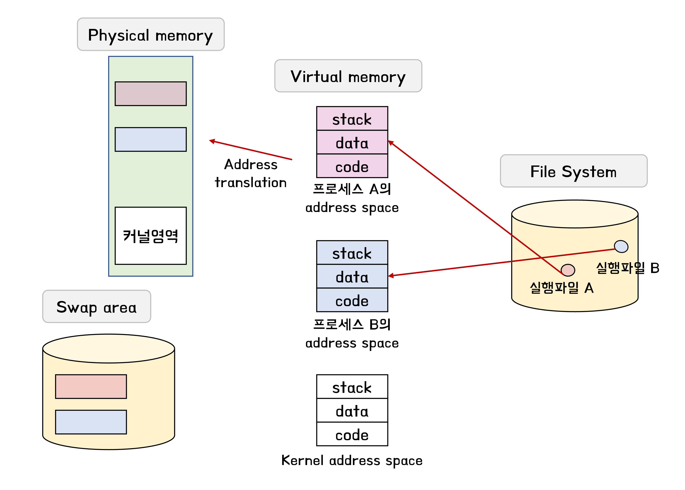
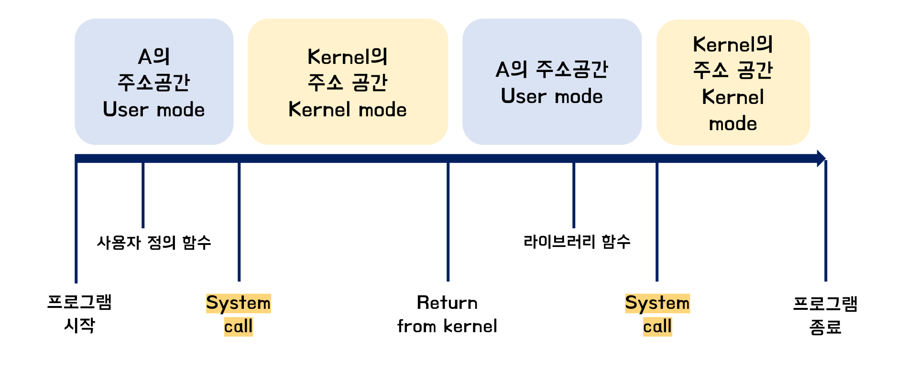

## 프로그램 실행 (메모리 load)

- 실행파일이 메모리로 올라가서 프로세스가 됨

- 물리적 메모리(physical memory)로 바로 올라가는 것이 아닌 virtual memory 단계를 거쳐서 올라감

  물리적 메모리에 virtual memory가 통채로 다 올라가는 것이 아닌 필요한 부분들만 올린다. 아닌 부분은 swap area(메모리 연장공간으로 사용)에

- virtual memory 공간 안에서는 독자적인 주소공간이 만들어진다.

- physical memory의 커널은 항상 메모리에 상주해 있다

- 하드 디스크에서 file system의 경우 전원이 나가도 유지/ swap area의 경우 사라짐

### 커널 주소 공간의 내용

- 운영체제도 하나의 프로그램-> 함수구조로 되어있다
- 운영체제의 코드를 호출을 통해서 사용할 수 있다 -> stack에 기록
- code
  - 커널 코드
    - 시스템콜, 인터럽트 처리 코드
    - 자원 관리를 위한 코드
    - 편리한 서비스 제공을 위한 코드
- data
  - 운영체제가 관리하는 자료구조들
    - 하드웨어별 자료구조 (CPU, memory, disk)
    - PCB: 프로그램을 관리하기 위한 자료구조
- stack
  - 사용자 프로그램마다 커널 스택을 따로 두고 있다
    - Process A의 커널 스택, Process B의 커널 스택 .....

### 사용자 프로그램이 사용하는 함수

- 프로세스의 code 부분에 포함
  - 사용자 정의 함수 : 자신의 프로그램에서 정의한 함수
  - 라이브러리 함수 : 자신의 프로그램에서 정의하지 않고 갖다 쓴 함수
- 커널 함수 : 운영체제 프로그램의 함수-> 운영체제 코드 부분
  - 커널함수 호출 == 시스템 콜

## 프로그램의 실행

- 사용자 프로그램을 실행할때 계속 하나의 코드만 실행하지 않는다

  
참고자료

  

    http://www.kocw.or.kr/home/search/kemView.do?kemId=1046323 
    Operating System Concepts 10th edition 
  

